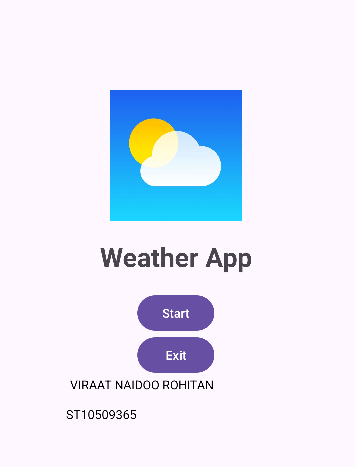
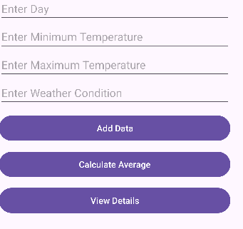
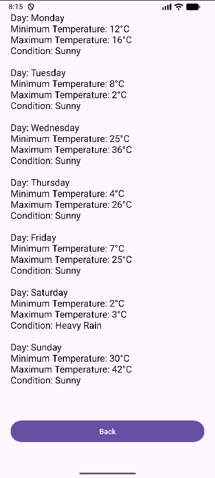

# 📱 Weather Temperature App

## 📌 Overview

This is a mobile weather application developed using **Kotlin in Android Studio**.
The app allows users to enter daily weather information including:

* Day of the week
* Minimum temperature
* Maximum temperature
* Weather condition

The application stores the data using arrays and displays a detailed weather report across multiple screens.

---

## 🚀 Features

* Splash screen with Start and Exit buttons
* User input for daily weather data
* Stores data using arrays / ArrayLists
* Calculates average minimum and maximum temperatures
* Detailed weather report screen
* Multi-screen navigation using intents
* Error handling for empty fields
* Loop used to display all entered data
* Clean and user-friendly interface

---

## 🧠 How It Works

The user enters weather information using text fields.

The app stores:

* Days
* Minimum temperatures
* Maximum temperatures
* Weather conditions

When the user clicks **Add Data**:

* The information is stored in arrays
* Validation checks ensure no fields are empty

When the user clicks **Calculate Average**:

* A loop calculates:

  * Average minimum temperature
  * Average maximum temperature

When the user clicks **View Details**:

* All weather information is passed to the detailed screen using intents
* A loop displays all entered weather data

---

## 📱 Screens

### 1. Splash Screen

* Displays app title
* Start button opens the main screen
* Exit button closes the app

### 2. Main Screen

* Allows users to enter:

  * Day
  * Minimum temperature
  * Maximum temperature
  * Weather condition
* Add Data button stores information
* Calculate Average button calculates averages
* View Details button opens detailed report screen

### 3. Detailed View Screen

* Displays all entered weather data
* Uses a loop to show:

  * Day
  * Minimum temperature
  * Maximum temperature
  * Weather condition

---

## 🛠 Technologies Used

* Kotlin
* Android Studio
* XML Layouts
* Arrays and ArrayLists
* Loops
* Intents for activity navigation

---

## ⚠️ Problems Encountered and Solutions

### Problem 1: App crashed when converting temperatures to integers

**Cause:**
The app attempted to convert empty EditText values using `.toInt()`.

**Solution:**
Validation was added to check if fields were empty before converting strings into integers.

---

### Problem 2: Data was not displayed on the detailed screen

**Cause:**
The arrays were not passed correctly between activities using intents.

**Solution:**
`putStringArrayListExtra()` and `putIntegerArrayListExtra()` were used to correctly transfer data.

---

### Problem 3: Only one day was displayed

**Cause:**
The arrays were being overwritten instead of adding multiple entries.

**Solution:**
`.add()` was used to continuously store multiple weather records inside ArrayLists.

---

### Problem 4: “No Data Available” message appeared incorrectly

**Cause:**
The retrieved arrays were null because the intent keys did not match.

**Solution:**
The same key names were used in both sending and receiving activities.

---

### Problem 5: Validation errors with isEmpty()

**Cause:**
`isEmpty()` was called directly on EditText objects instead of Strings.

**Solution:**
`.text.toString()` was used before validation checks.

---

## 👨‍💻 Author

Viraat Naidoo

---

## ✅ Notes

* Arrays / ArrayLists are used to store weather data
* Loops are used to calculate averages and display results
* Intents are used to pass data between activities
* Input validation prevents empty fields
* The app follows assignment requirements

---

## 🏆 Conclusion

This project demonstrates the use of:

* Android user interface design
* Kotlin programming
* Arrays and loops
* Activity navigation using intents
* Data validation and calculations

The application successfully meets all assignment requirements while providing a simple and functional weather tracking system.
